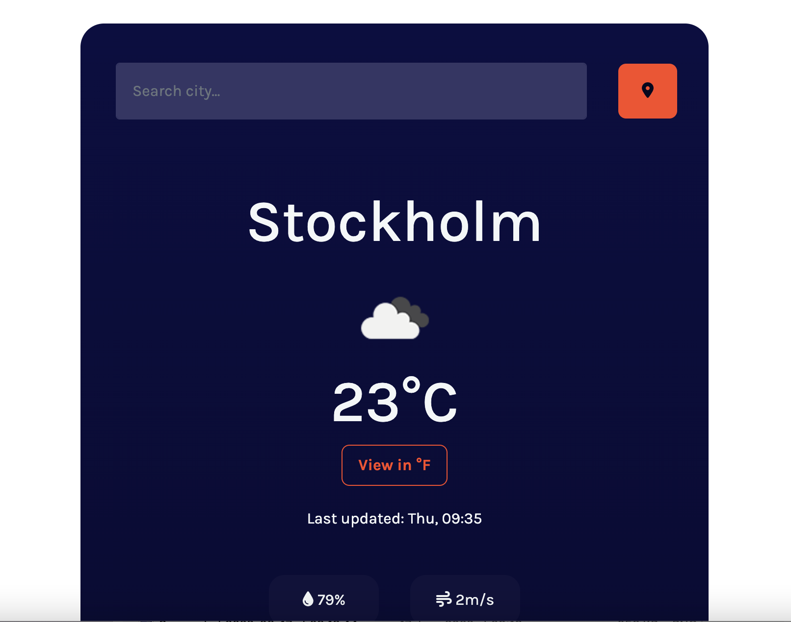

# ⛅ Weather App:
- A weather app designed and coded for responsive and user friendly users to be used across all types of devices. By default, the app will show the Stockholm current temperature. Users are able to click/tap on the get location button and app will display User's current city temperature. This app also
have many components: current temperature, the next few hours temperature, within 1 week temperature.

# Built with 🛠️:
- Figma
- HTML
- CSS
- Bootstrap
- Javascript

# Live Demo:
[Live Demo Link](https://nostalgic-goldstine-762fc6.netlify.app/)

# Author:
👩 **Katy Rosli**
- GitHub: [@KatyRosli](https://github.com/KatyRosli)

# Show your support:
Give a ⭐️ if you like this project!

Thank you!
